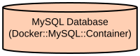

# MySQL Recipe Database Initialization and Data Processing Tool

This project provides a streamlined solution for initializing and populating a MySQL database with recipe, ingredient, and seasonal food data. It automates the process of converting JSON/CSV data into structured database entries, making it ideal for recipe management systems and food-related applications.

The tool handles three main data components: recipes, ingredients, and seasonal foods. It features automated data processing scripts that transform raw data into the required format and loads it into a MySQL database running in a Docker container. The system supports batch processing for improved performance and includes data validation to ensure data integrity.

## Repository Structure
```
.
├── data_processing/               # Data transformation scripts
│   ├── ingredient-process.py     # Processes raw ingredient data into CSV format
│   ├── json-to-csv.py           # Converts recipe JSON data to CSV format
│   ├── Readme.md                # Documentation for data processing
│   └── seasonal-process.py      # Processes seasonal food data
├── Dockerfile                    # MySQL 8.0 container configuration
├── init_ingredient.py           # Database initialization for ingredients
├── init_recipe.py              # Database initialization for recipes
├── init_seasonal.py            # Database initialization for seasonal foods
├── init.sql                    # Initial database schema
├── requirements.txt            # Python dependencies
└── run.sh                      # Main execution script
```

## Usage Instructions
### Prerequisites
- Docker (version 19.03.0+)
- Python 3.7+
- pip (Python package installer)

Required Python packages:
- mysql-connector-python
- pandas

### Installation

1. Clone the repository:
```bash
git clone <repository-url>
cd <repository-name>
```

2. Install Python dependencies:
```bash
pip install -r requirements.txt
```

3. Set up environment:
```bash
chmod +x run.sh
```

### Quick Start

1. Start the application:
```bash
./run.sh
```

This will:
- Build and start the MySQL Docker container
- Initialize the database schema
- Process and load all data

### More Detailed Examples

1. Processing recipe data manually:
```python
from data_processing.json_to_csv import process_recipes

# Convert JSON recipe data to CSV
process_recipes('path/to/recipes.json', 'output/recipes.csv')
```

2. Loading ingredients:
```python
from init_ingredient import connect_to_database, batch_insert_ingredients

# Connect to database
conn = connect_to_database('localhost', 'mlr-dev-db-tlb', 'test', 'test1234')

# Load ingredients
ingredients = ['ingredient1', 'ingredient2']
batch_insert_ingredients(conn, ingredients)
```

### Troubleshooting

1. Docker Connection Issues
- Error: "Cannot connect to the Docker daemon"
  - Solution: Ensure Docker service is running:
    ```bash
    sudo systemctl start docker
    ```

2. Database Connection Issues
- Error: "MySQL Connection refused"
  - Check if container is running:
    ```bash
    docker ps | grep mlrdb
    ```
  - Verify port mapping:
    ```bash
    docker port mlrdb-container
    ```

3. Data Loading Issues
- Error: "Duplicate entry"
  - Solution: Clear existing data:
    ```sql
    TRUNCATE TABLE Recipe;
    TRUNCATE TABLE Ingredient;
    TRUNCATE TABLE Seasonal;
    ```

## Data Flow
The system processes raw recipe, ingredient, and seasonal food data through a series of transformations before loading it into a MySQL database.

```ascii
[JSON/CSV Files] -> [Data Processing Scripts] -> [Formatted CSV] -> [MySQL Database]
                    (json-to-csv.py)              |
                    (ingredient-process.py)        |
                    (seasonal-process.py)          v
                                            [Docker Container]
```

Key Component Interactions:
1. Data processing scripts convert raw data into standardized CSV format
2. Docker container hosts MySQL instance with predefined schema
3. Python initialization scripts load processed data into database tables
4. Batch processing handles large datasets efficiently
5. Data validation ensures referential integrity
6. Error handling manages duplicate entries and connection issues

## Infrastructure



Docker Resources:
- MySQL Container:
  - Image: mysql:8.0
  - Port: 3306
  - Environment Variables:
    - MYSQL_ROOT_PASSWORD
    - MYSQL_DATABASE
    - MYSQL_USER
    - MYSQL_PASSWORD
  - Volumes:
    - init.sql -> /docker-entrypoint-initdb.d/